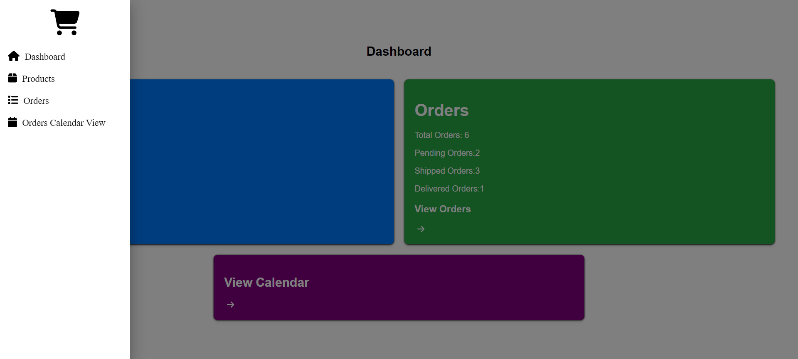

# ERP(Based On React)

Its a Enterprise resource planning website for product, shipping and customer management based on "REACTJS + Vite".

Technologies used : HTML,CSS,JAVASCRIPT,VITE+REACTJS, REACT ROUTER.

"VITE + REACT" -> This template provides a minimal setup to get React working in Vite with HMR and some ESLint rules.

Pre Requisite -> 'Node Js' should be installed on the device

TO start the website follow these steps

1) WE go to erp folder in VS Code
2) Open a terminal
3) Enter the command : 'npm i'
4) Enter the command : 'npm run dev'
5) Click the url generated and it will take you to the website.
6) To terminate the website we enter "ctrl+ c" on terminal in vs code 
7) Then type "y" and press enter

The website opens to a homepage(Dashboard)
Its consist of three other pages which are (Product Management, Order Management, Orders Calendar View)
Each of these pages can be accessed by clicking on the name in hamburger icon on the top left as well as the widgets present on the dashboard.

# Sidebar

There Is a "hamburger icon" present on the "top left corner" on "all the pages" for navigation between the pages.

# Dashboard

	the dashboard is also the homepage.
	the dashboard consist of widgets which give the summarized view to the erp.
	these widgets as well as the icons on the hamburger icon on the top left can be used to access the other 3 pages

# Product Management

product page

product edit page

product add page

	the product management page consist of data of the product in the stock ,thier price and catagory
	we can edit the prodcut information by clicking on "edit" button which will send you to edit page where we can edit 
	product details.
	We can delete a product by clicking on the "delete" button.
	There is a button with "+" icon at the bottom right to add new product, on clicking the button it takes you to new page where we can add details to add new products.
	The page on the top has search bar,to search the products on that page.

# Order Management

	the order management page consist of data of the order details,order status, and thier customer details.
	it show the amount of order a customer made, quantity and price.
	The page also has option to change order status(Shipped,Delivered,Processing,Dispached) on individual orders as well as to delete orders
	The page on the top has search bar,to search the orders on that page by using order Id eg. 1,2,3,etc.

# Orders Calendar View

	It has monthly calendar view which showcase when the order was placed and the order status.

This erp website has a very simple design which can be easily navigated, and has a basic functionality to manage products , thier customers and order delivery status and there quantity, products can be added, deleted and edited.
The website is also responsive and very easy to navigate.

Icons taken from awesomefonts.

The website has been hosted using VERCEL and its url is given below:

# click on the link -> "https://erp-jade-six.vercel.app/"

